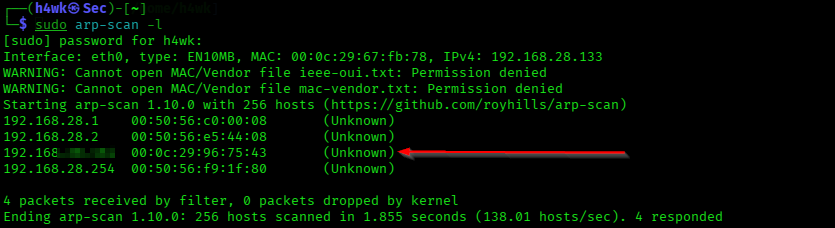
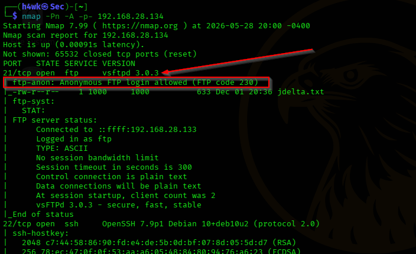
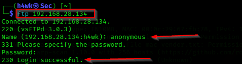
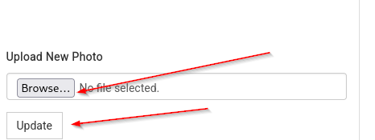
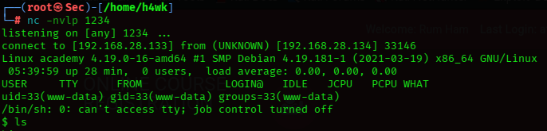
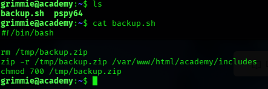
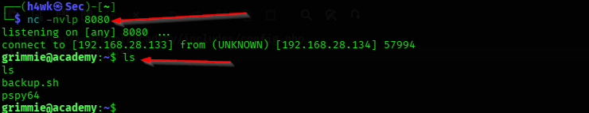

# BrightMind Penetration Testing

## Overview

A hands-on internal network penetration-testing assessment of the BrightMind server in a controlled virtual-machine lab. The assessment demonstrated an end-to-end attack path from host discovery and service enumeration to web exploitation and root-level compromise.

> **Lab / educational use only:** All testing was performed against an intentionally vulnerable lab target in a controlled environment.

## Objectives

- Identify exposed hosts and services.
- Enumerate FTP and web services.
- Assess exposed sensitive information and credential security.
- Validate the security impact of an unrestricted file-upload weakness.
- Demonstrate privilege-escalation risk caused by writable privileged scripts.
- Document remediation recommendations.

## Environment

| Component | Details |
|---|---|
| Attacker | Kali Linux |
| Target | BrightMind VM |
| Testing type | Internal penetration test |
| Target IP | BrightMind VM (private lab network) |
| Key tools | Nmap, arp-scan, fping, FTP, Hashcat, FFUF, Netcat, LinPEAS, pspy |

## Attack Path

```text
Network Discovery
      ↓
Host Verification
      ↓
Nmap Service Enumeration
      ↓
Anonymous FTP Access
      ↓
Sensitive File Retrieval
      ↓
Weak Hash Identification / Cracking
      ↓
Web Directory Enumeration
      ↓
Academy Portal Access
      ↓
Unrestricted File Upload
      ↓
Reverse Shell as www-data
      ↓
LinPEAS / pspy Enumeration
      ↓
Writable Root-Executed Script
      ↓
Root Privilege Escalation
```

## Key Findings

| Finding | Impact | Risk |
|---|---|---|
| Anonymous FTP access | Sensitive files could be retrieved without proper authentication. | High |
| Weak MD5 password hashing | Password hashes were susceptible to dictionary-based recovery. | High |
| Unrestricted file upload | A crafted server-side file could be uploaded and executed. | Critical |
| Writable privileged script | A normal user could influence a script executed by root. | Critical |
| Root privilege escalation | The attack chain resulted in complete administrative control of the lab server. | Critical |

## Evidence

### 1. Reconnaissance

ARP-based host discovery identified the BrightMind system on the lab network.



### 2. Nmap Enumeration

A full TCP scan with service and OS enumeration identified exposed FTP, SSH, and HTTP services.



### 3. FTP Enumeration

Anonymous FTP access was available and allowed retrieval of a sensitive file.



### 4. Web Enumeration

Directory enumeration identified the `/academy` web endpoint.


### 5. File Upload Weakness

The Academy profile functionality accepted an uploaded file without adequate validation.



### 6. Remote Shell

The upload weakness was used in the controlled lab to obtain a shell as the web-service account.



### 7. Privilege Escalation

Further enumeration identified a writable script that was executed with root privileges.



### 8. Root Access

The final stage demonstrated the security impact: root-level access to the BrightMind lab server.



## Remediation Recommendations

1. Disable anonymous FTP access and restrict FTP exposure to approved users and networks.
2. Replace weak password hashing such as MD5 with a modern password-hashing scheme such as Argon2id or bcrypt.
3. Enforce strict file-upload validation, including allow-listed extensions, MIME/content validation, randomized storage names, and storage outside executable web directories.
4. Review file and directory permissions so unprivileged accounts cannot modify scripts executed by root.
5. Review scheduled tasks and privileged automation for unsafe writable paths.
6. Apply least privilege and separate service accounts from administrative accounts.
7. Monitor authentication, file-upload, process-execution, and privilege-escalation events.

## Full Report

The complete assessment report is available in [`report/BrightMind-Penetration-Test-Report.pdf`](report/BrightMind-Penetration-Test-Report.pdf).

## Disclaimer

This repository documents a controlled cybersecurity lab exercise. Techniques and evidence shown here should only be used on systems for which you have explicit authorization to test.
